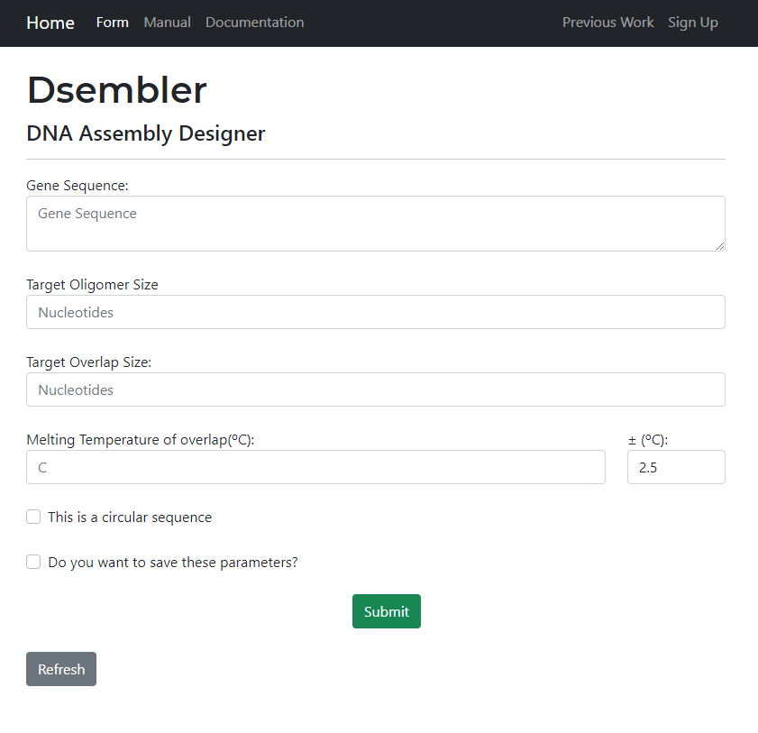
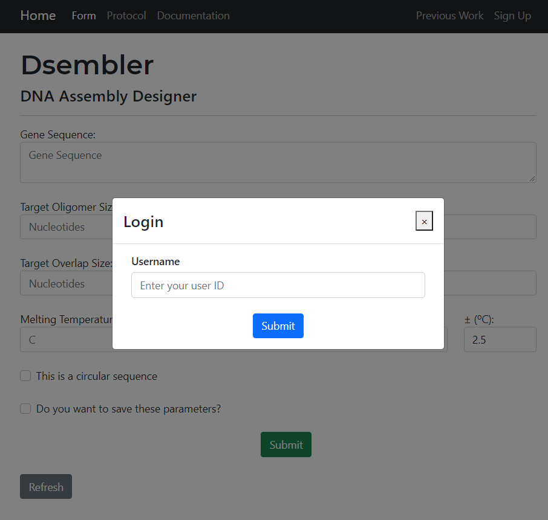
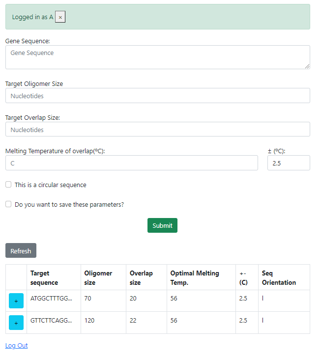

# Dsembler (DNA Assembly Designer)

Dsembler is an easy to use web program for assembling short genomes that selects the best possible oligomer sequences based on the users' target parameters.

## Installation

Dsembler can be installed via GitHub. Users should have docker installed on their computer to run Dsembler locally. Docker can be downloaded from <https://docs.docker.com/get-docker/> [Ensure your BIOS settings are compatible with the docker application]. Run the following commands on your terminal
```
git clone https://github.com/sblabkribb/dsembler-dev.git
```
Move to the dsembler-dev directory

### Build docker image build
```
$ docker build -t dsembler:latest .
```

Or pull the docker image from Dockerhub

```
docker pull sblabkribb/dsembler:latest
```

### Docker run for web version (Linux)

```
docker run -d --rm -v $(pwd):/app --publish 5000:5000 --name dsembler dsembler
```

### Docker run for web version (Windows command line, cmd)

```
docker run -d --rm -v %cd%:/app --publish 5000:5000 --name dsembler dsembler
```
=======================================================================

## Usage

Detailed User Manual can be found at <https://github.com/sblabkribb/dsembler/blob/main/documents/manual.pdf>

The user interface is simple to navigate through as shown below:  First enter in the required parameters to generate appropriate oligomers for your gene assembly.

-   Gene Sequence
-   Oligomer Size
-   Overlap Size
-   Target Melting Temperature of overlaps
-   Acceptable range of target melting temperature
-   Sequence Orientation
-   User ID (if saving query)

> Note: Melting Temperature of overlaps are calculated based on the Nearest Neighbour Equation and the Sugimoto (1996) thermodynamic table.

Two buttons will appear on the same page once the target parameters are submitted:

-   Download the Excel file
-   Download the FASTA file

### Dsembler script version

1.   Stop docker webversion if it's running.
```
docker stop dsembler
```
2.   Place a target fasta file to input directory

3.   Run docker

```
docker run --rm -v %cd%:/app -w /app dsembler python script.py -f input/test.fasta -ol 150 -ov 20
```
 
Multiple command lines are allowed

```
docker run --rm -v %cd%:/app -w /app dsembler python script.py -f input/test.fasta -ol 150 -ov 21
docker run --rm -v %cd%:/app -w /app dsembler python script.py -f input/test.fasta -ol 150 -ov 22
docker run --rm -v %cd%:/app -w /app dsembler python script.py -f input/test.fasta -ol 150 -ov 23
```


4. Check the output file in output_script directory


#### Previous Data

|                  Login                   |                      Previous Work                       |
|:----------------------------------------:|:--------------------------------------------------------:|
|  |  |

Users can sign up and login to access their previous data. The database was created using the Flask-SQLite.

=======================================================================

## Python 3.8.5

### Libraries used:

-   Biopython: This extensive library was used to parse the FASTA files, calculate melting temperature, calculate GC, check Alignment scores between two sequences.
-   Flask: This library/tool was used to make a simple web-based user interface. Related libraries such as Flask_bootstrap, wtforms, flask_SQLite supported the page as well

=======================================================================

### Workflow

The algorithm workflow is outlined below figure:


